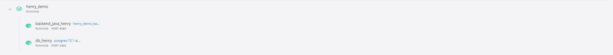

# LITEON_Test by Htein Lin Aung

Backend(Java Spring Boot)

## Deployment
(Requires docker and docker compose to be installed)

(Postman installation is recommended to test out api)

### Run Docker Command

From the main directory (the one with docker-compose.yml file) run the command:
```docker compose build```

Once complete, run:
```docker compose up -d```

Backend Project will be running port `8080` accessed by localhost host IP adress. In my case, it's `http://localhost:8080/` or `http://192.168.0.120:8080`

### Expected output after building docker image



### Availabel API list

| Method | URL | Action |
| ------ | --- | ------ |
| POST   |  http://localhost:8080/api/auth/signup   | New account creatoin
| POST   |  http://localhost:8080/api/auth/login  | Login to the system
| GET   |  http://localhost:8080/api/auth/refreshToken/{refresh_token}   | Get refresh token when access token is expired
| POST   |  http://localhost:8080/api/todo/create   | Create new todo item
| POST   |  http://localhost:8080/api/todo/update   | Update todo item
| DELETE   |  http://localhost:8080/api/todo/delete/{todo_id}   | Delete todo item (only available for super_admin)
| GET   |  http://localhost:8080/api/todo/myitem   | Get todo item created by login user
| GET   |  http://localhost:8080/api/todo/all   | Get all todo list (only available for super_admin)

*** May import postman exported file with predefine Json Request structure.


