# LITEON_Test by Htein Lin Aung

Backend(Java Spring Boot)

## Deployment
(Requires docker and docker compose to be installed)

(Postman installation is recommended to test out api)

### Run Docker Command

From the main directory (the one with docker-compose.yml file) run the command:
```docker compose build```

Once complete, run:
```docker compose up -d```

Backend Project will be running port `8080` accessed by localhost host IP adress. In my case, it's `http://localhost:8080/` or `http://192.168.0.120:8080`

### Expected output after building docker image

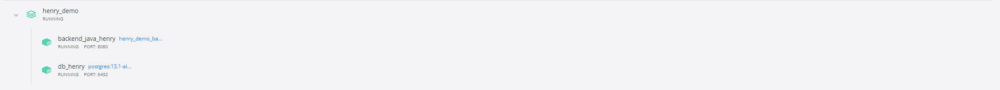

### Availabel API list

Swagger endpoint (http://localhost:8080/swagger-ui/index.html)

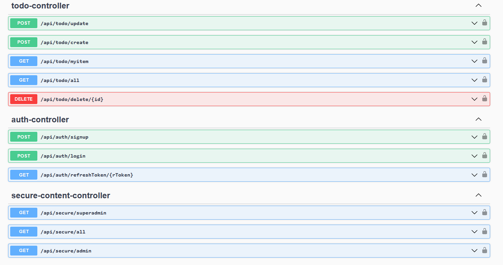

| Method | URL                                                         | Action                                             |
| ------ | ----------------------------------------------------------- | -------------------------------------------------- |
| POST   | http://localhost:8080/api/auth/signup                       | New account creatoin                               |
| POST   | http://localhost:8080/api/auth/login                        | Login to the system                                |
| GET    | http://localhost:8080/api/auth/refreshToken/{refresh_token} | Get refresh token when access token is expired     |
| POST   | http://localhost:8080/api/todo/create                       | Create new todo item                               |
| POST   | http://localhost:8080/api/todo/update                       | Update todo item                                   |
| DELETE | http://localhost:8080/api/todo/delete/{todo_id}             | Delete todo item (only available for super_admin)  |
| GET    | http://localhost:8080/api/todo/myitem                       | Get todo item created by login user                |
| GET    | http://localhost:8080/api/todo/all                          | Get all todo list (only available for super_admin) |

*** May import postman exported file with predefine Json Request structure.

| User Name   | Role         | Password |
| ----------- | ------------ | -------- |
| Superadmin  | SUPER_ADMIN  | Abcd123$ |
| Normaladmin | NORMAL_ADMIN | Abcd12#$ |


### Testcases

###### 1. Superadmin Test Scenario
| Step   | Action                                                                                | Expected Result          |
| ------ | ------------------------------------------------------------------------------------- | ------------------------ |
| Step 1 | Login to the sysetm using Superadmin account                                          | 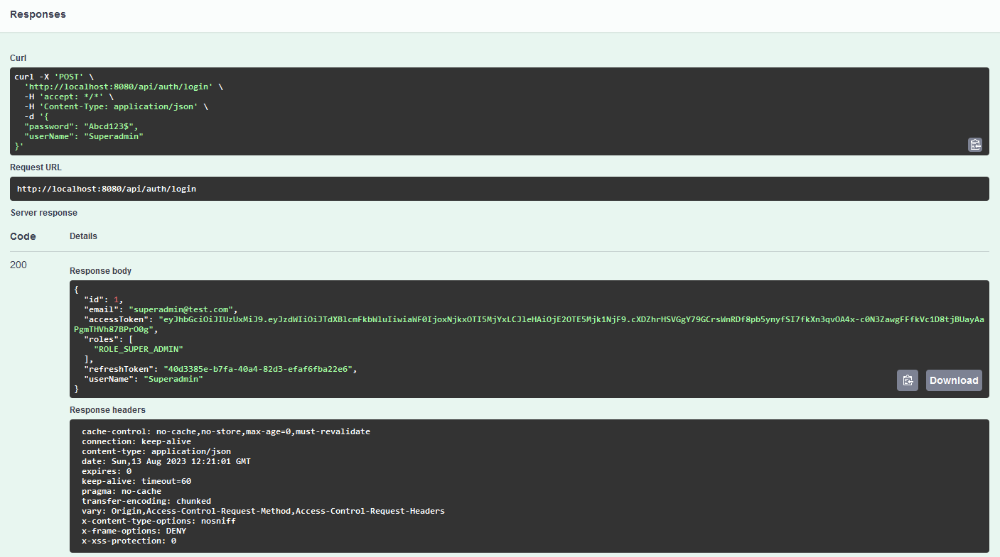 |
| Step 2 | Use accesstoke value from step 1 to authorize protected api                           | 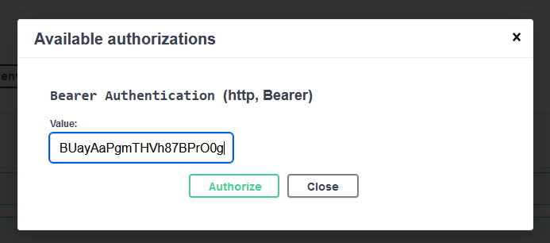 |
| Step 3 | Retrieve all todo items                                                               | 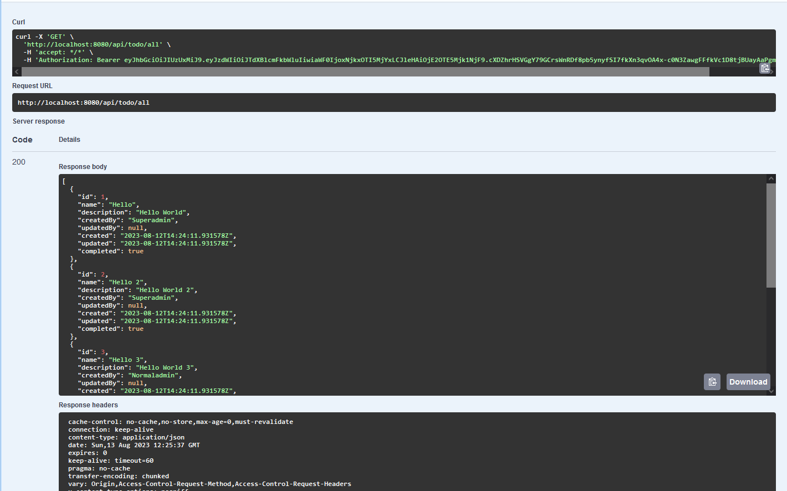 |
| Step 4 | After 5 minutes, Try step 3 and ended as unauthorized because accesstoken was expired | 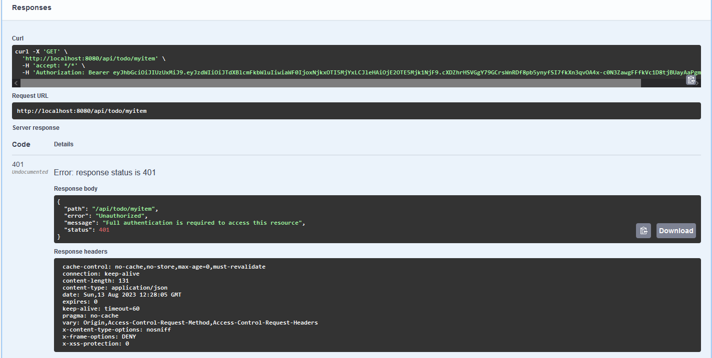 |
| Step 5 | Use refresh token value from step 1 and call refresh token api                        | 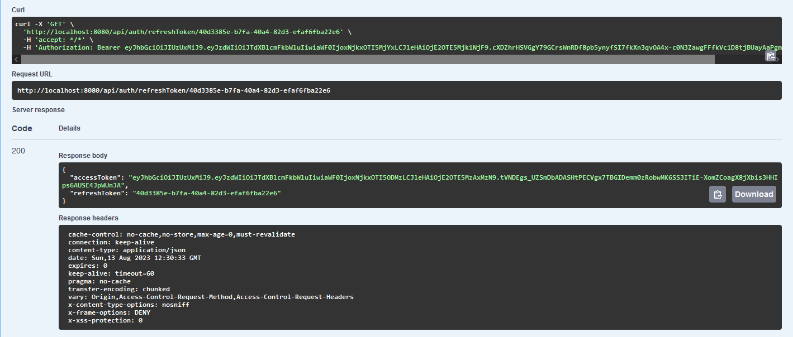 |
| Step 6 | Try log out and provide new access toke from Step 5                                   | 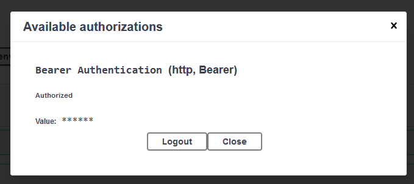 |
| Step 7 | Try step 3 and this time will get successful result                                   | 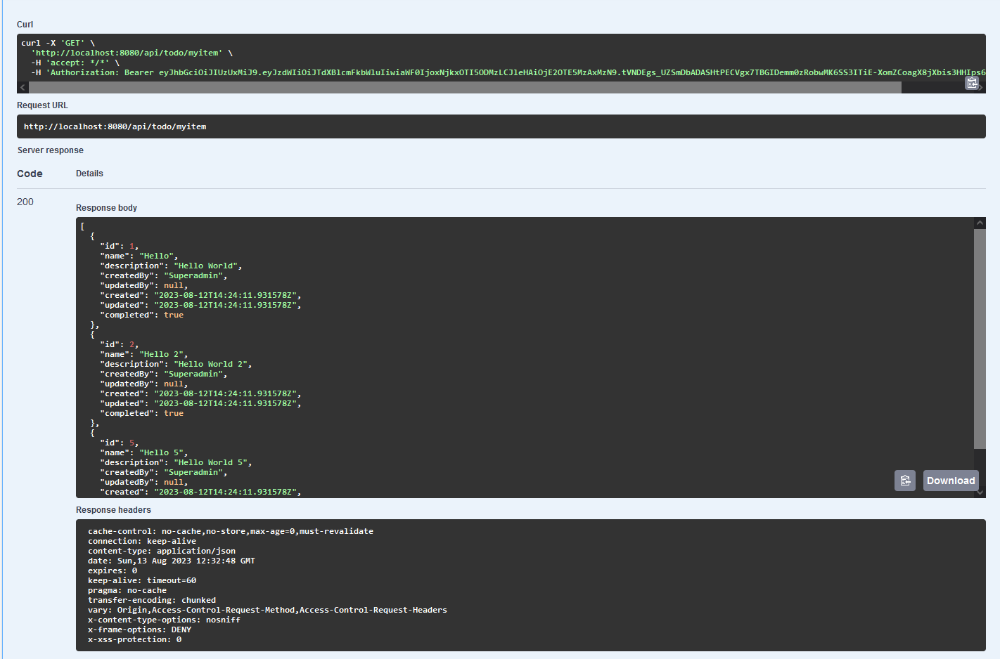 |
| Step 8 | Log out of the system                                                                 |  |

###### 2. Normaladmin Test Scenario
| Step   | Action                                                                                                          | Expected Result           |
| ------ | --------------------------------------------------------------------------------------------------------------- | ------------------------- |
| Step 1 | Login to the sysetm using Normaladmin account                                                                   | 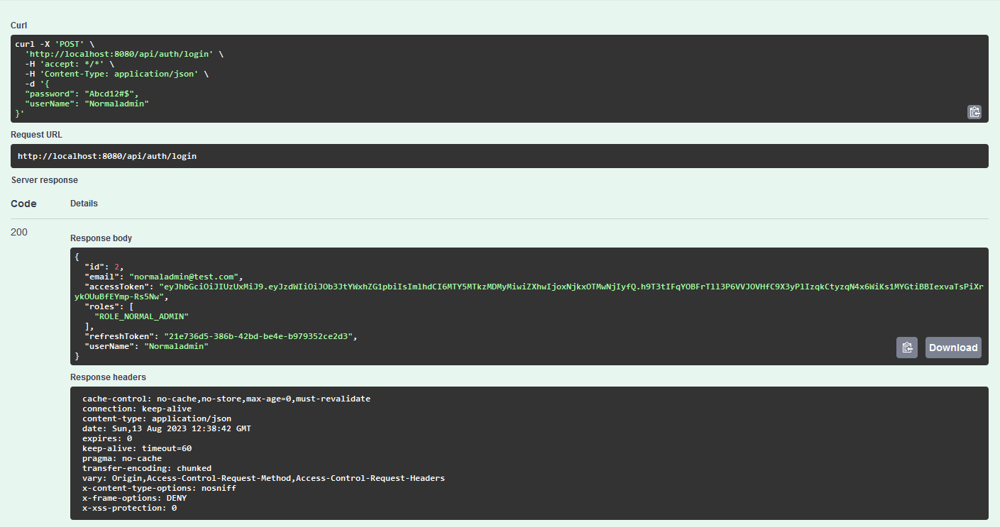  |
| Step 2 | Use accesstoke value from step 1 to authorize protected api                                                     |   |
| Step 3 | Retrieve all todo items and ended as unauthorized because that api is only allowed for superadmin role          |   |
| Step 4 | Retrive my todo items and will get successful result                                                            | 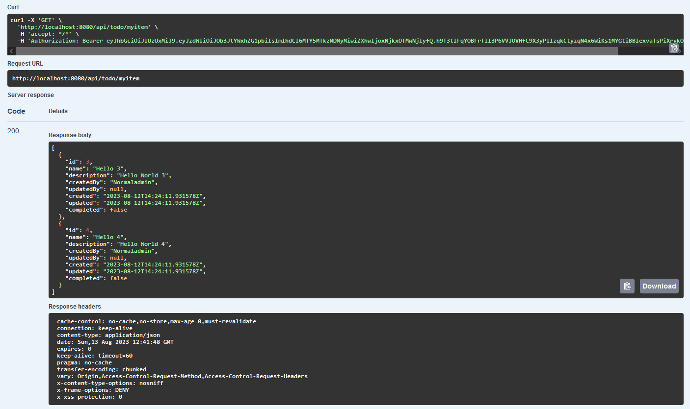 |
| Step 5 | Try to call delete todo for id 5 and ended as unauthorized because that api is only allowed for superadmin role | 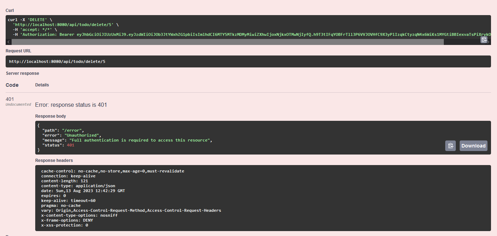 |
| Step 6 | Log out of the system                                                                                           |   |

###### 3. CRUD Test Scenario

| Step   | Action                                                      | Expected Result           |
| ------ | ----------------------------------------------------------- | ------------------------- |
| Step 1 | Login to the sysetm using Superadmin account                |   |
| Step 2 | Use accesstoke value from step 1 to authorize protected api |   |
| Step 3 | Try create new todo item                                    | 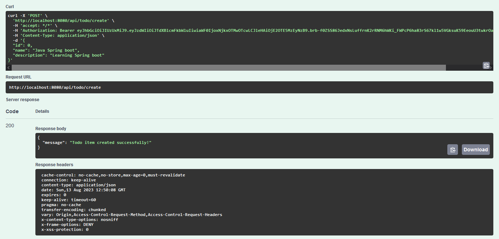 |
| Step 4 | Try update existing todo item                               | 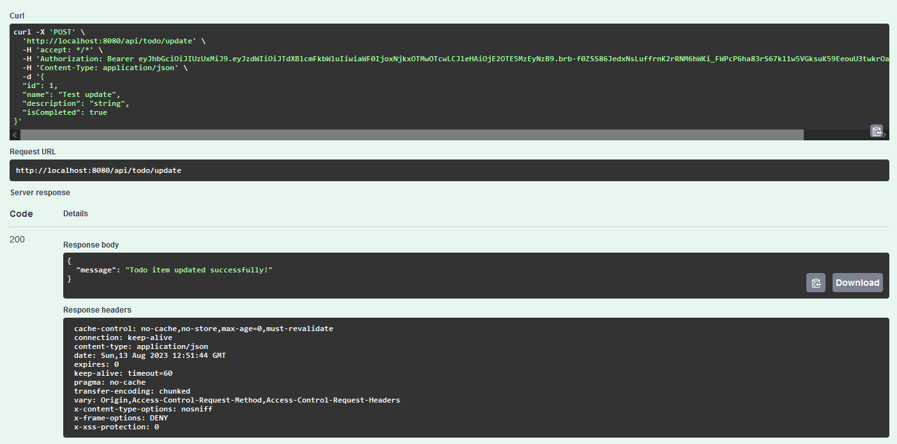 |
| Step 5 | Try to delete existing todo item                            | 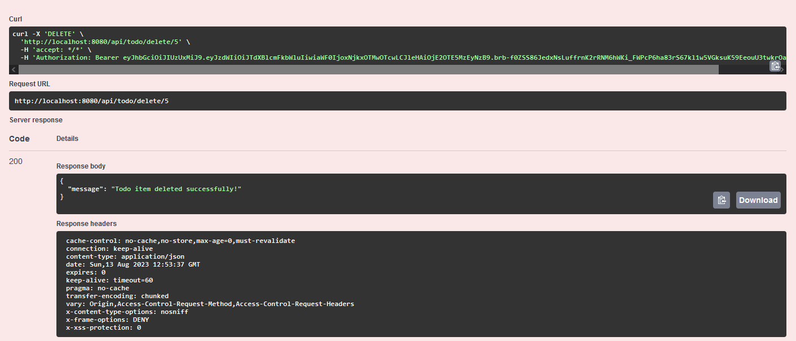 |
| Step 6 | Retrieve all todo items                                     |   |
| Step 7 | Log out of the system                                       |   |
